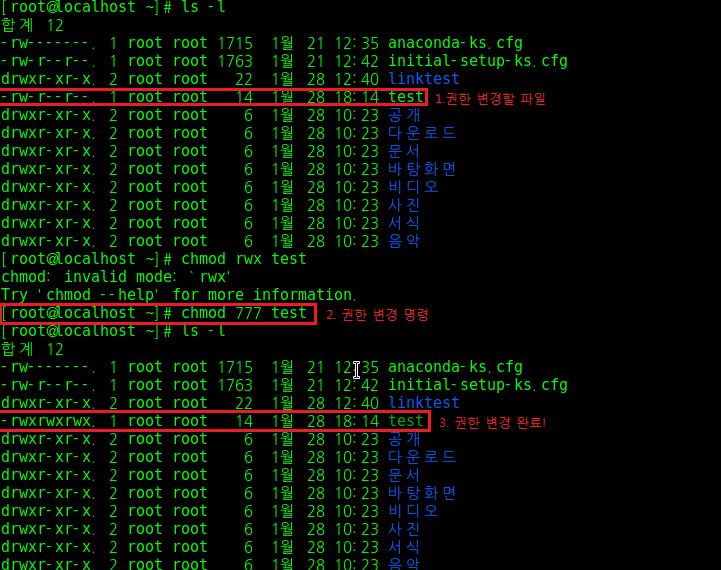

파일 권한 및 소유권 변경 명령문
==============================

파일 권한 변경 명령문
------------------------------
### Intro

리눅스 파일은 세 가지 권한이 존재한다.  
1. 읽기(Read, r) 권한
2. 쓰기(Write, w) 권한
3. 실행하기(Execute, x) 권한

특정 파일에 대한 권한을 지정한다는 것은 매우 중요하다.  
이커머스 서버에서 고객 정보를 관리하는 파일은 관리자만이 읽고 쓰고(수정하고) 실행해야하는 파일이다.  
만약 이 파일의 권한이 public하게 주어진다면 이는 재앙에 가까운 불상사가 발생할 것이다.  
다행히도(?) 리눅스 운영체제에서는 이러한 불상사를 막기 위해 파일에 대한 권한을 변경하는 명령문이 존재한다. 함께 알아보자.

### 명령어: chmod ### 파일명.(확장자)

여기서 ###에는 숫자가 들어간다.  
총 세 개의 숫자가 들어가는데 순서대로 root user에게 부여할 권한/ group user에게 부여할 권한/ other user에게 부여할 권한/ 을 의미한다.  
부여할 권한은 숫자로 나타난다 => 읽기 권한(r) 4, 쓰기권한(w) 2, 실행권한(e) 1.  
권한의 조합은 합으로 이루어진다. 특정 유저에게 rwx를 모두 부여하고 싶으면 4+2+1인 7, rw만 부여하고 싶으면 4+2인 6, r만 부여하고 싶으면 4를 입력하면 된다.

chmod 777 test 명령문 결과를 보면 root, group, other에게 모두 읽기/쓰기/실행하기 권한이 주어졌다.  
그렇다. 저 명령문은 모든 user에 대해 동일한 권한을 부여할 때 사용되는 명령어이다.  
우리의 관심사는 Intro에서 말한 불상사를 막는 것이다. 그렇다면 user 별 각기 다른 권한을 부여하는 방법을 알아보자.

### 명령어: chmod

