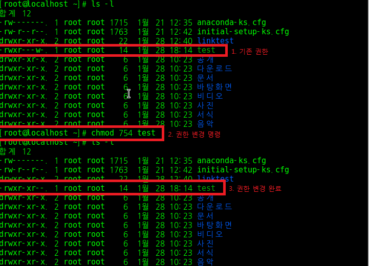

파일 권한 및 소유권 변경 명령문
==============================

파일 권한 변경 명령문
------------------------------
### Introduction

리눅스 파일은 세 가지 권한이 존재한다.  
1. 읽기(Read, r) 권한
2. 쓰기(Write, w) 권한
3. 실행(Execute, x) 권한

특정 파일에 대한 권한을 지정한다는 것은 매우 중요하다.  
이커머스 서버에서 고객 정보를 관리하는 파일은 관리자만이 읽고 수정하고 처리해야하는 파일이다.  
만약 이 파일의 권한이 public하게 주어진다면 이는 재앙에 가까운 불상사가 발생할 것이다.  
다행히도(?) 리눅스 운영체제에서는 이러한 불상사를 막기 위해 파일에 대한 권한을 변경하는 명령문이 존재한다. 함께 알아보자.

### 명령문: chmod ### 파일명.[확장자]

여기서 ###에는 숫자가 들어간다.  
총 세 개의 숫자가 들어가는데 순서대로 user(소유자) 권한/ group 권한/ other 권한을 의미한다.  
부여 권한은 숫자로 나타난다 => 읽기 권한(r) => 4, 쓰기 권한(w) => 2, 실행 권한(e) => 1.  
권한의 조합은 합으로 이루어진다. 특정 유저에게 rwx를 모두 부여하고 싶으면 4+2+1인 7, rw만 부여하고 싶으면 4+2인 6, r만 부여하고 싶으면 4를 입력하면 된다.

chmod 754 test 명령문 결과를 보면 user 에게는 모든 권한이, group 에게는 읽기/실행하기, other 에게는 읽기 권한이 각각 주어졌다.  

### 명령문: chmod 변경 대상(+/-) 권한 파일명.[확장자]

각 user 별로 권한을 따로 따로 설정해주는 명령어도 있다.  
'변경 대상'에는 user를 의미하는 u, group을 의미하는 g, other를 의미하는 o가 들어간다
'+/-'는 권한 부여/삭제를 의미한다
'권한'에는 r, w, x가 들어간다.  
예를 들어, other 사용자에게 쓰기 권한을 추가시키기 위한 명령문은 다음과 같다: ***chmod o+ w test***
해당 명령어를 리눅스 터미널에 직접 입력해보자.

정상적으로 other 사용자의 권한이 변경된 것을 확인할 수 있다.

파일 소유권 변경 명령문
-------------------
### Introduction
리눅스에서 각 파일은 해당 파일을 소유하는 소유자 유저가 있다.  
파일을 소유한 유저는 위에서 배운 '파일 권한 부여'를 할 수 있는 권한을 가진다 (chmod는 파일 소유자 유저 혹은 관리자만이 실행할 수 있다.)  
파일의 소유권을 변경하는 것은 중요하고도 신중해야 하는 일이다. 중요한 파일이 신뢰할 수 없는 유저의 소유일 경우 group이나 other에게 쓰기 혹은 실행 권한을 주는 등 시스템적으로 큰 손상을 줄 수 있기 때문이다.
따라서 파일의 ***소유권을 변경하는 명령어는 오로지 root 계정만이 실행할 수 있다.***

### 명령문: chown 사용자이름(.그룹이름) 파일명

현재 test 파일을 소유자는 root이다 해당 파일의 소유자를 bigdata12 유저의 소유로 변경해보자.

정상적으로 test 파일의 소유자가 변경된 것을 확인할 수 있다.

### 주의할 점
test 파일은 소유자가 실행 권한을 가지고 있다. 이제 test 파일의 소유자인 bigdata12 유저는 해당 파일을 실행할 수 있는 권한이 생겼다.

그런데, bigdata12 유저는 자신 소유의 파일인 test를 실행하지 못한다. 이게 어떻게 된 일일까?
결론부터 말하자면, test 파일이 현재 위치한 root 디렉토리는 root 디렉토리를 소유한 root 계정 외에는 접근하지 못한다.  
즉, 내 물건이 다른 사람 소유의 사물함에 있어 꺼내서 쓰지 못하는 상황에 비유할 수 있다.

결국 bigdata12는 해당 사물함의 주인인 root에게 물건을 꺼내달라고 부탁해야 한다.

파일 위치 변경 명령문
------------------
친절한 root씨는 bigdata12 소유의 test 파일을 bigdata12의 사물함에 옮겨주려고 한다. 이 때 사용하는 명령문을 보자

### 명령문: mv 파일명 ~이동할 위치

이제 bigdata12는 파일을 실행 할 수 있게 되었다.

파일 실행 명령문
-------------
우여곡절 끝에 bigdata12 유저는 파일을 실행하고 결과를 볼 수 있게 되었다. test가 위치한 디렉토리로 찾아가서 실행해보자

### 명령문: ./파일명
